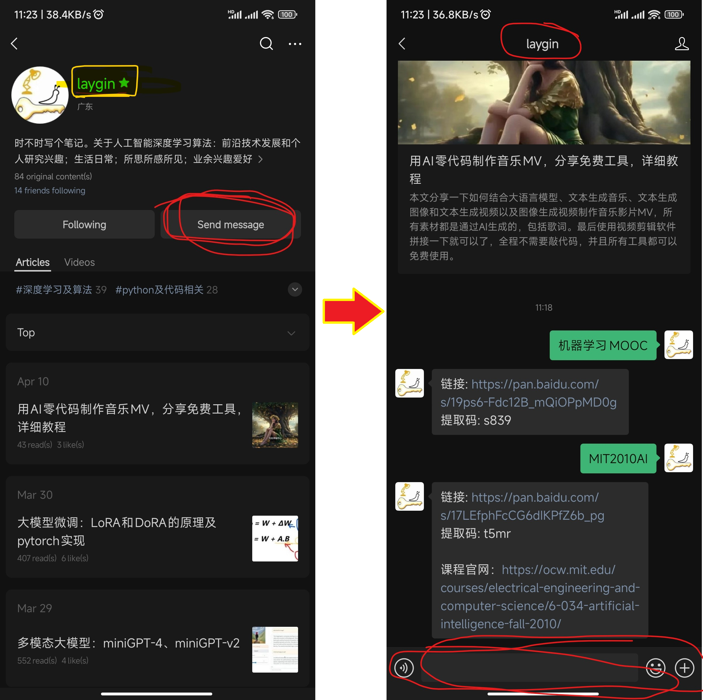
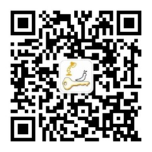
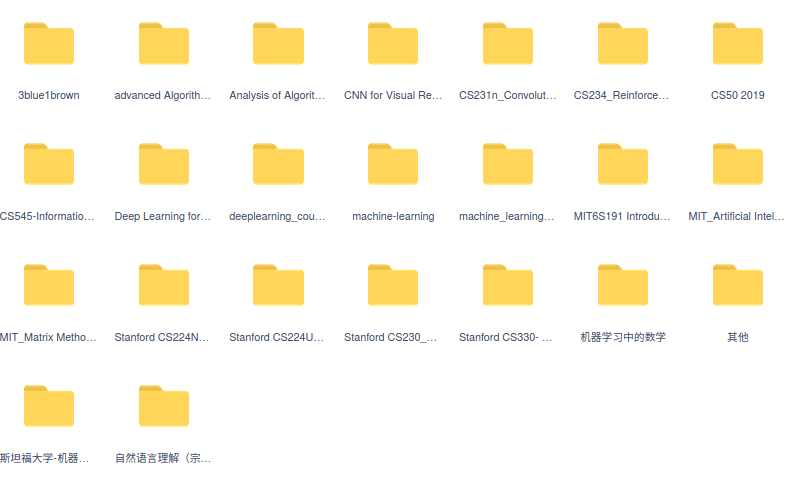
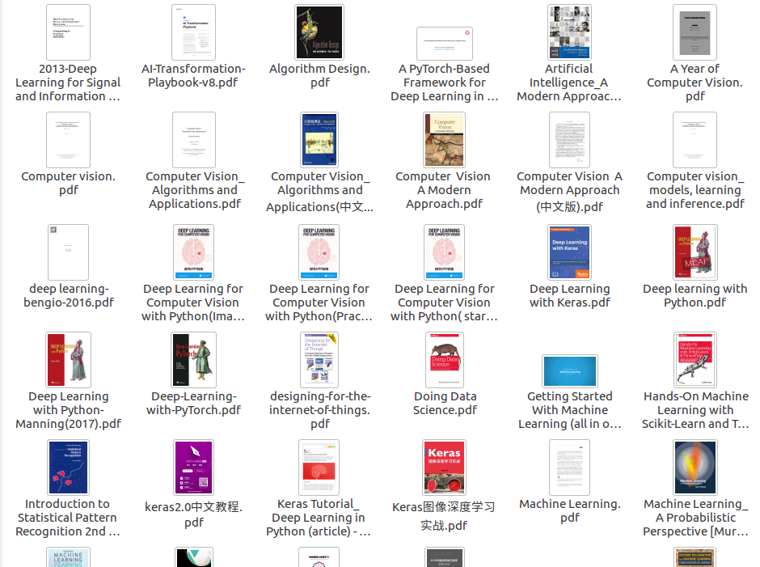
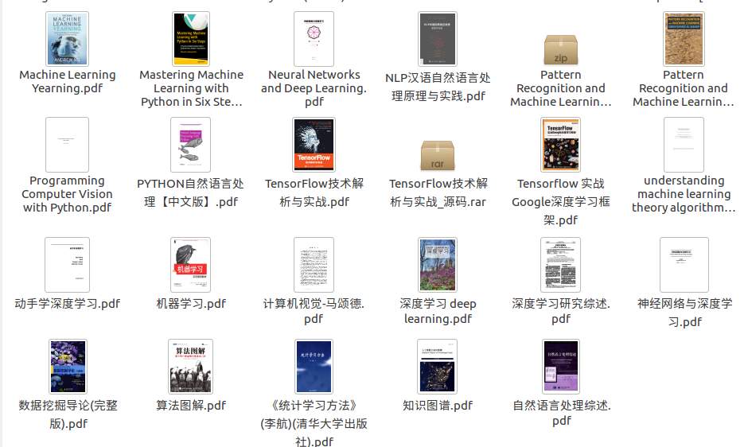
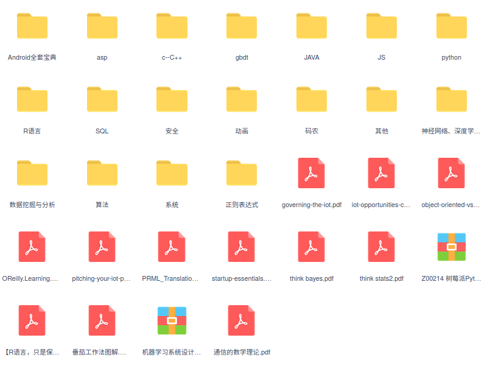

# 学习资料分享

>多年学习下来，积累了大量的资源和素材，包括在线课程、国内外名校公开课、高质量的书籍、论文、数据集等，花了许多心血。

> 内容主要有：深度学习，机器学习，计算机视觉，Python，算法，C/C++, 安卓开发, 数据分析与挖掘, 大学教材等。

> 这些资源使我受益良多，然而现在却躺在网盘里无用武之地，所以决定整理之后全部分享出来，造福更多有需要的朋友。

> 由于资源很多很大，只能通过网盘进行共享。同时为了便于分门别类整理，使用公众号回复关键字自动获取下载链接，条理十分清晰，也便于更新。

> 分类整理也要花很多时间精力，只能陆续更新。

## 获取资源链接示例


1. 获取[麻省理工大学-人工智能课程2010-温斯顿教授](https://mp.weixin.qq.com/s?src=11&timestamp=1611222317&ver=2842&signature=j3eTM9jWNOdGyfRNAfRfBnBdRrRVcqQ*0fXMWnoRex*noG7sGADCvsb-xDo94f0WLdG*7Nv3EeR9eHlaP-LKRO-P27I0NeeHgWR*WFW1Luzj7IS8vL4czEjVXWVmRfYs&new=1)只需要回复关键字 `MIT2010AI` 即可
2. 获取[CS231n：CNN for Visual Recognition（两学期）](https://mp.weixin.qq.com/s?src=11&timestamp=1611223284&ver=2842&signature=j3eTM9jWNOdGyfRNAfRfBnBdRrRVcqQ*0fXMWnoRex87-bjhhfVEwlDVld0dY25oInT8ynMy5uiH1ExYUk6CMKwRrTfc2sBlhfMkfE6rY9MUFiTMM*KsFIcnS9jiCsJl&new=1) 的关键字为 `CS231nSpring2017` 和 `CS231nWinter2016`
3. 获取[吴恩达两门机器学习课程视频](https://mp.weixin.qq.com/s?src=11&timestamp=1611223284&ver=2842&signature=j3eTM9jWNOdGyfRNAfRfBnBdRrRVcqQ*0fXMWnoRex*SWHLO7Lvc0NWR8XAkjjLIS4fbc2ak5N0AR1Rb3vOUxsfy8z9bmOB3PuFk-PjzAdHUNG3PoN1Q7kVEzMWNZxgQ&new=1) 的关键字为 `机器学习斯坦福` 和 `机器学习MOOC`
4. 更多关键字（持续更新）
```
课程：
CS231nSpring2017
CS231nWinter2016
机器学习MOOC
机器学习斯坦福
MIT2010AI
CS234RL
CS50
CS545研讨会系列
牛津大学深度学习
MIT6S191
斯坦福CS230深度学习
MIT矩阵方法Spring2018
DL4NLP
NLP斯坦福
斯坦福CS224N
斯坦福CS224U
自然语言处理
斯坦福CS330多任务与元学习
StatQuest机器学习
线代的本质
机器学习中的数学

书籍：
python书籍
深度学习书籍
机器学习书籍
C语言书籍
安卓书籍
教材电子书
算法书籍
刻意练习
```

*公众号二维码：*


## 部分资源截图
> 更多资源截图详见 [files](./files)










<font size=1 color='grey'>免责声明: 本人不具有这些资源的任何版权，皆是从网上收集而来，且时间久、资源多，出处已不可考，仅供个人学习所用，不要用于商业或非法用途，由此造成的任何损失，本人概不负责，此外，若有侵权请告知，本人将立即删除</font>
